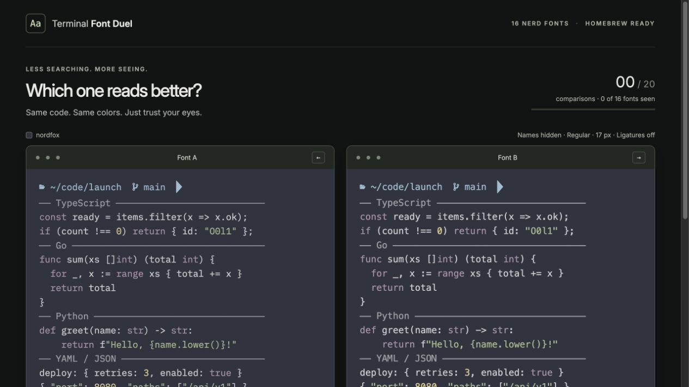

# Terminal Font Duel

**Pick by eye. Find your terminal font.**

A blind tournament for terminal fonts. Compare two real Nerd Fonts in identical code samples, pick the one that reads better, and keep going until you have a favorite. **16 families. At most 20 comparisons. No installation needed to try them.**



## Why this exists

Choosing a terminal font can turn into a research project: browse a gallery, learn a pile of names, install a few fonts, edit your configuration, and try to remember how the previous one looked.

The useful question is much smaller: **which of these two would you rather read all day?**

Terminal Font Duel puts that question in front of you. Names stay hidden while you compare, so you can notice the shapes, spacing, punctuation, and little details without a font's reputation making the decision. Both sides use the same colors and code, including the awkward characters that matter in a terminal: `0O`, `1Il`, braces, operators, and icons.

The goal is to find a font you enjoy using in a few minutes. A small shortlist, good defaults, and permission to say “both” or “neither” keep the process simple. Every candidate is available through Homebrew, so choosing a font leads directly to a reproducible installation command.

## How a duel works

1. **Look at two fonts.** Their names are hidden; their sample, size, weight, spacing, and colors are identical.
2. **Pick left, right, both, or neither.** A preferred font advances, both-good keeps both, and neither eliminates both.
3. **Meet your shortlist.** Names are revealed alongside a Homebrew command and a WezTerm configuration snippet.

All 16 families appear in the first eight comparisons if you keep going. Choosing one side each time produces a winner in 15 comparisons. Ties can extend the tournament to 20; remaining favorites share the result. You can inspect your favorites earlier, and Undo restores the previous comparison. Rejecting everything produces an honest empty result.

This is a preference shortcut, not an exhaustive ranking: bracket order and ties can affect the shortlist.

| Control | Action |
| --- | --- |
| **←** / **→** | Choose the left / right font |
| **↑** | Both good |
| **↓** | Neither |
| **U** | Undo |
| **See favorites so far** | Inspect the fonts you have liked |

Buttons provide the same controls. Progress is saved in this browser automatically.

## What you are comparing

- **Actual fonts:** bundled regular monospaced faces, loaded before voting is enabled. A failed download offers Retry instead of a fallback comparison.
- **Everyday code:** TypeScript, Go, Python, YAML, JSON, Git diff, logs, ambiguous characters, and Nerd Font icons.
- **Consistent settings:** 17 px text, equal line height, and programming ligatures off during the duel. Try ligatures on the result screen.
- **JetBrains Mono included:** compare its standard face, then inspect the actual no-ligature face on the shortlist.
- **A local session:** no account, analytics, or application backend. Votes and the palette stay in local storage. Font assets are served by the app itself.

Use a wide browser window for side-by-side previews. Narrow windows stack them. The samples are fixed code specimens; browser rendering can differ from WezTerm, so check your final choice in the terminal after installing it.

### The shortlist

| | | | |
| --- | --- | --- | --- |
| JetBrains Mono | Fira Code | Caskaydia Cove | Hack |
| Iosevka | Meslo LG | Source Code Pro | IBM Plex Mono |
| Mononoki | Victor Mono | 0xProto | Commit Mono |
| Geist Mono | Roboto Mono | Go Mono | Monaspice Neon |

These are Nerd Font variants; their patched family names can differ from the names above. The result gives you the exact installed family name. Package versions, source URLs, checksums, and licenses are recorded in [the font manifest](src/data/fonts.json).

The browser comparison works on any OS with a modern browser. The installation flow currently targets **Homebrew and WezTerm**. Previewing fonts does not install them on your computer.

## Run locally

Requires **Node.js 22.12+** and npm. Python and Homebrew are not required to run the app; browser font files are included.

```sh
npm ci
npm run dev
```

Open [localhost:5175](http://127.0.0.1:5175/).

To check the production build:

```sh
npm run build
npm run preview
```

Open [localhost:4175](http://127.0.0.1:4175/). `dist/` contains the static site, including its font assets and licenses. No server-side runtime or secrets are needed.

## Colors

The default palette is **nordfox**. The companion color picker's **Choose a font** link can pass another palette in the URL fragment; both previews use it, and it is saved locally. Terminal Font Duel also works on its own.

When hosting the two apps separately, build the color picker with `VITE_FONT_PICKER_URL` pointing to Terminal Font Duel. The fragment format and validation are described in [the architecture notes](docs/architecture.md#palette-handoff).

## Development

Built with **TypeScript, React, and Vite**. Vitest covers the tournament, saved-session validation, configuration exports, and font asset integrity.

```sh
npm test
npm run build
```

See [CONTRIBUTING.md](CONTRIBUTING.md) for the project layout, font import workflow, and review checklist. [Architecture notes](docs/architecture.md) explain how comparisons, loading, and persistence work.

## License and credits

Application code is [MIT licensed](LICENSE). Fonts and icon glyphs retain their original licenses; keep [the third-party notices](THIRD-PARTY-NOTICES.md) and [bundled license files](public/licenses/) when redistributing the app.

Thanks to the font designers, [Nerd Fonts](https://www.nerdfonts.com/), [Homebrew](https://brew.sh/), and [WezTerm](https://wezterm.org/) for making this possible. Terminal Font Duel is an independent community project.
